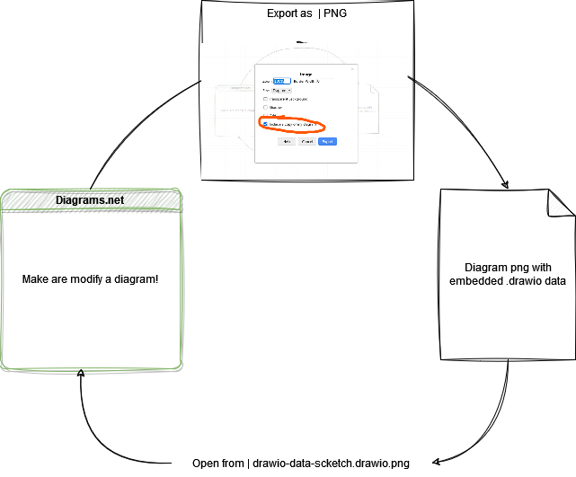

# Diagrams.net (Draw.io)

[Diagrams.net](https://app.diagrams.net) is my currently goto choice until Mermaid gets up to speed with the ability to control more of the output.

The best feature it has is it's ability to embed it's core data in an image itself leaving no room to go hunt for the source material when updating the docs.

Check it out yourself by download this image and opening it in [Diagrams.net](https://app.diagrams.net)

